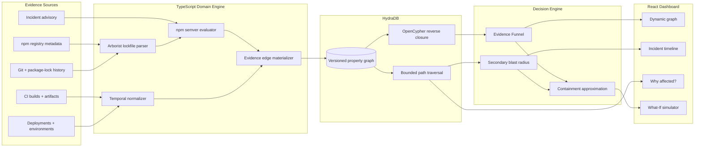
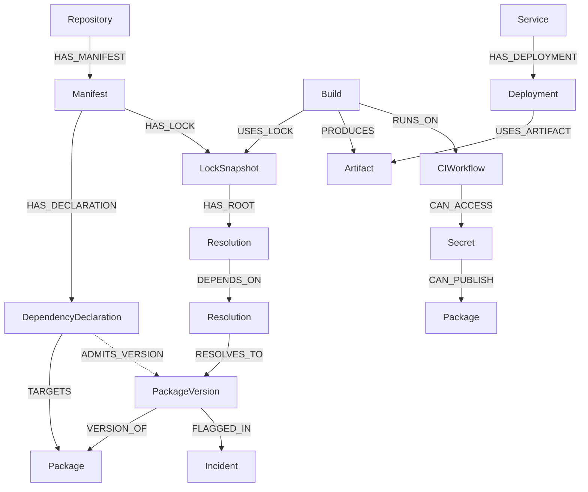

<div align="center">

# 🛡️ HydraGuard

### From compromised package to contained incident—one evidence-backed graph path at a time.

**A version-aware, time-aware supply-chain blast-radius and containment engine built on HydraDB.**

[](https://hackhydra.hydradb.com/)
[](https://www.typescriptlang.org/)
[](https://github.com/hydra-db/hydradb)
[](https://opencypher.org/)
[](#-license)

[Demo video](#-demo) · [Architecture](#-architecture) · [Methodology](#-the-evidence-funnel) · [Quick start](#-quick-start) · [Threat model](#-threat-model)

> **HackHydra 2026 — Track 2: Repos, dependencies and code as graphs**<br>
> **Option A: Supply Chain Blast Radius**

</div>

---

## Why HydraGuard exists

At 09:00, a package version is reported malicious. Security teams do not need another alert that says *"package X exists somewhere."* They need defensible answers before the next build ships:

- Which version ranges could select the compromised release?
- Which lockfiles actually resolved it?
- Which CI builds installed it while it was live?
- Which artifacts reached production?
- Did the compromised build environment expose publishing or cloud credentials?
- What is the smallest set of actions that collapses the active blast radius?

HydraGuard treats this as a **graph-constrained incident-response problem**, not a similarity search and not a flat vulnerability scan.

### A conventional scanner sees a list

```text
repo-a  -> bad-lib@1.2.4  -> vulnerable
repo-b  -> bad-lib@1.2.3  -> safe
repo-c  -> bad-lib        -> unknown
```

### HydraGuard reconstructs the path and the evidence

```text
Service
  └─ Deployment at 19:28
      └─ Artifact sha256:7d…
          └─ CI Build at 19:23
              └─ LockSnapshot from commit 9f1…
                  └─ Resolution node_modules/a/node_modules/bad-lib
                      └─ bad-lib@1.2.4
                          └─ flagged in incident window 19:20–19:33

CI Build
  └─ ran on release workflow
      └─ could access npm publishing token
          └─ could publish 18 additional packages
```

The result is not merely *"connected."* It is **eligible, resolved, built, deployed, execution-relevant, or privileged**, with every conclusion attached to a path that an analyst can inspect.

---

## ✨ What makes HydraGuard different

| Capability | What it changes |
|---|---|
| **Evidence Funnel** | Replaces blanket red alerts with deterministic stages: Connected → Semver-Eligible → Resolved → Built → Deployed → Privileged. |
| **Version-aware traversal** | Distinguishes an exact safe pin from a range that could admit a malicious release. |
| **Temporal reconstruction** | Intersects lockfile history, CI events and deployment events with the incident's publication window. |
| **Secondary blast radius** | Traverses beyond code into workflows, secrets, maintainers and package-publishing authority. |
| **Containment simulation** | Approximates the smallest high-impact set of pins, revocations, quarantines and rollbacks. |
| **Explainable paths** | Shows why each service is affected instead of returning an opaque risk percentage. |
| **Real incident replay** | Replays the May 11, 2026 TanStack compromise using the published package/version timeline rather than inventing an attack. |

HydraGuard assumes that an incident signal already exists—from a registry action, advisory, threat-intelligence feed or analyst. Its job begins at the urgent question: **"Are we exposed, how certain are we, and what should we do first?"**

---

## 🏗️ Architecture



### Why TypeScript for the domain layer?

npm resolution is domain logic, not graph logic. HydraGuard uses Node.js and TypeScript so it can rely on the ecosystem's native tools:

- [`semver`](https://www.npmjs.com/package/semver) for npm-compatible range evaluation
- [`@npmcli/arborist`](https://www.npmjs.com/package/@npmcli/arborist) for dependency and lockfile tree interpretation
- `neo4j-driver` for HydraDB's Bolt-compatible interface

This boundary is deliberate:

| HydraGuard TypeScript engine | HydraDB |
|---|---|
| Parse manifests and lockfiles | Persist the property graph |
| Evaluate npm semver ranges | Execute reverse dependency closure |
| Reconstruct temporal evidence | Traverse bounded variable-length paths |
| Classify evidence stages | Resolve service, maintainer and secret paths |
| Rank containment candidates | Re-query residual exposure after exclusions |

**HydraDB performs the graph work. HydraGuard performs npm and incident-response domain logic.**

---

## 🧬 Graph model

HydraGuard does not flatten a lockfile into global package nodes. A lockfile may install multiple copies of the same version at different paths, so every concrete installation is represented as a `Resolution` node.



### Core entities

| Entity | Purpose |
|---|---|
| `Package` / `PackageVersion` | Registry identity and immutable release identity |
| `DependencyDeclaration` | Requested range, dependency kind and manifest context |
| `LockSnapshot` | One historical lockfile state with a validity interval |
| `Resolution` | Exact installed package instance and `node_modules` path |
| `Build` / `Artifact` | Evidence that a lock snapshot became executable output |
| `Deployment` / `Service` | Evidence that an artifact reached an environment |
| `CIWorkflow` / `Secret` | Lateral compromise and publishing authority |
| `Maintainer` / `Organization` | Shared ownership and infrastructure relationships |
| `Incident` | Compromised versions and the interval in which they were live |

Stable identities make imports repeatable:

```text
package:     npm:@scope/name
version:     npm:@scope/name@1.2.4
resolution: <lock-hash>:node_modules/a/node_modules/@scope/name
build:       <repository>:<build-id>
artifact:    <registry>:<digest>
```

---

## 🔎 The Evidence Funnel

Connectivity is not proof of compromise. HydraGuard narrows the graph through ordered, deterministic evidence.


| Stage | Deterministic question | Minimum evidence |
|---:|---|---|
| **1 · Connected** | Does any dependency path reach the package? | HydraDB path exists |
| **2 · Semver-Eligible** | Could the declared range select the compromised version? | `semver.satisfies(version, range)` |
| **3 · Resolved** | Did a lock snapshot contain that exact version? | Concrete `Resolution` node |
| **4 · Built** | Did CI use that lock snapshot? | Build-to-lock relationship |
| **5 · Deployed** | Did the resulting artifact reach an environment? | Deployment-to-artifact relationship |
| **6 · Execution-Relevant** | Could malicious behavior execute? | Install script, import/call reachability or runtime evidence |
| **7 · Privileged** | Could execution reach sensitive authority? | Workflow-to-secret path |

The dashboard reports a funnel rather than one inflated number:

```text
87 connected services
31 semver-eligible
12 resolved the malicious version
 7 built an affected artifact
 4 deployed the artifact
 2 exposed privileged CI credentials
```

No LLM invents a score. Every transition is reproducible from graph facts.

---

## 🧮 Version-aware paths

Assume `bad-lib@1.2.4` is malicious:

```json
{
  "dependencies": {
    "bad-lib": "1.2.0"
  }
}
```

The exact declaration does not admit `1.2.4`.

```json
{
  "dependencies": {
    "bad-lib": "^1.2.0"
  }
}
```

The range admits `1.2.4`, but that still does **not** prove installation. HydraGuard keeps three facts separate:

```text
Range admits 1.2.4     ≠ lockfile resolved 1.2.4
Lockfile resolved it   ≠ CI installed it
CI installed it        ≠ affected artifact was deployed
```

The TypeScript engine evaluates ranges and materializes `ADMITS_VERSION` evidence edges. HydraDB then traverses only the relevant package, resolution and service paths.

HydraGuard also preserves dependency context—production, development, peer and optional—but does not assume that `devDependency` means low risk. A compromised build tool running inside a privileged CI workflow can be more dangerous than an unused runtime library.

---

## ⏳ Temporal reconstruction

HydraGuard reads the Git history of `package-lock.json` and creates immutable `LockSnapshot` nodes:

```text
Snapshot A: valid from commit A until commit B
Snapshot B: valid from commit B until commit C
Snapshot C: valid from commit C until present
```

Each snapshot records:

```json
{
  "commitSha": "9f1c…",
  "committedAt": 1780000000000,
  "validFrom": 1780000000000,
  "validTo": 1780100000000,
  "evidenceSource": "git-lockfile-commit",
  "timePrecision": "commit-time"
}
```

A Git commit bounds when a version was recorded; it is not proof of the exact second that `npm install` ran. HydraGuard strengthens the timeline when CI installation, artifact and deployment records are available:

```text
Semver eligibility  -> possibility
Lockfile commit     -> repository evidence
CI installation     -> build evidence
Artifact SBOM       -> artifact evidence
Deployment event    -> production evidence
```

This evidence hierarchy prevents timestamps from being presented with more certainty than their source supports.

---

## 🟣 Secondary blast radius: when code reaches credentials

Supply-chain attacks do not stop at application dependencies. Install-time malware can execute inside CI, discover credentials and use those credentials to publish additional packages or access cloud environments.

HydraGuard models that lateral path explicitly:

```text
Compromised PackageVersion
  <- RESOLVES_TO - Resolution
  <- DEPENDS_ON  - Root Resolution
  <- USES_LOCK   - Build
  -> RUNS_ON     - CI Workflow
  -> CAN_ACCESS  - npm Publishing Token
  -> CAN_PUBLISH - 18 other Packages
  <- DEPENDS_ON  - additional Services
```

The dashboard renders direct application exposure in red and credential-mediated propagation in purple. This separates two different response problems:

1. **Consumption blast radius** — who built or deployed the malicious package?
2. **Authority blast radius** — what else could the compromised environment publish, access or alter?

Shared maintainer, organization and publishing-infrastructure relationships are traversable through the same graph.

---

## 🧯 Minimal Containment Simulator

Finding 40 affected services is useful. Telling an incident commander what to do next is better.

HydraGuard generates candidate controls from affected paths:

- Pin or override a dependency to a known-safe version
- Revoke a publishing or cloud token
- Disable a compromised workflow
- Quarantine a build artifact
- Roll back a deployment
- Rotate credentials reachable from an affected runner

The engine computes each candidate's path coverage and applies a greedy hitting-set approximation:

```text
impact(action) = newly blocked confirmed paths / estimated operational cost
```

It repeatedly selects the highest-impact action, then asks HydraDB for the residual graph. The result is explainable rather than mathematically overstated:

```text
Before containment
  40 active deployments
  18 packages reachable through publishing authority

Recommended actions
  1. Revoke npm-token-7        -> blocks all 18 publication paths
  2. Pin bad-lib to 1.2.3      -> blocks 31 dependency paths
  3. Quarantine images 184–187 -> removes 9 active deployments

After simulated containment
   0 active deployments
   0 publication paths
   2 historical artifacts retained for investigation
```

HydraGuard calls this an **approximation**, not a guaranteed global minimum. Analysts can toggle actions and inspect exactly which paths disappear.

---

## 🌐 OpenCypher reverse closure

A representative affected-service query follows exact resolutions from a compromised package back through lockfiles, builds, artifacts and deployments:

```cypher
MATCH p =
  (service:Service)
  -[:HAS_DEPLOYMENT]->(deployment:Deployment)
  -[:USES_ARTIFACT]->(artifact:Artifact)
  <-[:PRODUCES]-(build:Build)
  -[:USES_LOCK]->(lock:LockSnapshot)
  -[:HAS_ROOT]->(root:Resolution)
  -[:DEPENDS_ON*0..12]->(hit:Resolution)
  -[:RESOLVES_TO]->(bad:PackageVersion {key: $versionKey})
WHERE build.startedAt >= $compromisedFrom
  AND build.startedAt <= $compromisedTo
RETURN DISTINCT service, deployment, build, p
```

HydraDB's bounded variable-length traversal and reverse adjacency are the execution layer behind the product's central question: **which internal services reach this exact version, through which path, at the relevant time?**

---

## 🎬 Real incident replay: TanStack, May 2026

HydraGuard's reference scenario replays the May 11, 2026 TanStack supply-chain compromise:

- **42** affected `@tanstack/*` packages
- **84** malicious package versions
- Published across a **six-minute** window
- Follow-on propagation across npm and PyPI projects
- A CI-originated compromise where valid provenance alone was not enough to establish safety

The replay combines:

- Real package names, versions and publication timestamps from the public postmortem
- Real npm registry metadata captured with source and retrieval timestamps
- A clearly labelled internal-organization fixture for repositories, builds, artifacts, services and credentials

Public incident facts are real; internal enterprise topology is synthetic because private victim infrastructure is not public. HydraGuard never blurs that distinction.

The replay button advances through evidence events rather than animating fictional malware diffusion:

```text
19:20  malicious versions become available
19:21  compatible declarations become semver-eligible
19:23  CI resolves an affected version
19:25  artifact is produced
19:28  artifact reaches production
19:30  incident signal arrives
19:40  publishing token is revoked
19:50  clean artifact replaces affected deployment
```

Incident reference: [TanStack npm supply-chain compromise postmortem](https://tanstack.com/blog/npm-supply-chain-compromise-postmortem).

---

## 📊 Benchmark and reproducibility contract

Performance claims will be published only from a reproducible run against a pinned HydraDB commit and checked-in demo fixture.

### Reference replay profile

| Property | Demo profile |
|---|---:|
| Graph vertices | 25,000 |
| Graph relationships | 110,000 |
| Compromised versions | 84 |
| Affected package identities | 42 |
| Maximum traversal depth | 12 hops |
| Internal repositories | 15 |
| Internal services | 12 |

### Acceptance targets—not measured results

| Operation | Target | Current status |
|---|---:|---|
| HydraDB reverse dependency closure | ≤ 38 ms | ⏳ Measurement pending |
| Evidence Funnel classification | ≤ 75 ms | ⏳ Measurement pending |
| Complete blast-radius report | ≤ 180 ms | ⏳ Measurement pending |
| What-If residual recomputation | ≤ 250 ms | ⏳ Measurement pending |

> The numbers above are engineering targets for the reference fixture, not benchmark evidence. Final results must include hardware, HydraDB commit, node/edge counts, warm/cold state, query text and repeated-run statistics. They will not be relabelled as results until the benchmark command exists and reproduces them.

The final report will record:

```text
HydraDB commit
Machine and storage profile
Vertex and relationship counts
Import duration
Cold and warm traversal latency
p50 / p95 / p99 across repeated queries
Complete-report latency
Containment re-query latency
```

This distinction matters in security tooling: unverified speed claims are not evidence.

---

## 🚀 Quick start

> **Development status:** HydraGuard is currently at the architecture/scaffold stage. The end-to-end workspace, Docker Compose service and commands below define the intended local run contract; they must not be treated as working setup until the corresponding files land and are validated.

### Prerequisites

- Git
- Docker Desktop with WSL2 on Windows, or Docker Engine on Linux/macOS
- Node.js 20+
- npm 10+

### Intended local workflow

```powershell
# Clone the application and pinned HydraDB source
git clone --recurse-submodules <repository-url> HydraGuard
Set-Location HydraGuard

# Configure local services
Copy-Item .env.example .env

# Start HydraDB
docker compose -f infra/docker-compose.yml up -d hydradb

# Install pinned application dependencies
npm ci

# Seed the reference incident and organization graph
npm run ingest:tanstack

# Run the API and dashboard
npm run dev
```

Expected endpoints:

| Service | URL |
|---|---|
| Dashboard | `http://localhost:5173` |
| HydraGuard API | `http://localhost:3000` |
| HydraDB Bolt | `bolt://127.0.0.1:7687` |
| HydraDB HTTP | `http://127.0.0.1:8443` |
| HydraDB readiness | `http://127.0.0.1:9090/readyz` |

Expected environment contract:

```dotenv
HYDRADB_URI=bolt://127.0.0.1:7687
HYDRADB_USER=neo4j
HYDRADB_TOKEN=replace-with-local-development-token
HYDRADB_DATABASE=default
API_PORT=3000

# Analyst authorization for typosquatting finding review.
# Required in production; falls back to a development value otherwise.
# 16-512 characters, no whitespace.
TYPOSQUATTING_ANALYST_BEARER_TOKEN=replace-with-local-development-analyst-token

# Trusted reviewer identity recorded on every analyst-review Evidence node.
TYPOSQUATTING_ANALYST_PRINCIPAL=local-dashboard-analyst

# Dashboard copy of the same token, read from dashboard/.env at build time.
VITE_TYPOSQUATTING_ANALYST_TOKEN=replace-with-local-development-analyst-token
```

The API reads `process.env` directly and does not auto-load `.env`. Export the
variables in your shell, or start it with `npx tsx --env-file=.env src/api/index.ts`.
The dashboard is a Vite app, so it does load `dashboard/.env` automatically, but
inlines `VITE_`-prefixed values into the public bundle at build time. Treat the
dashboard token as public to anyone who can load the page; it prevents
caller-asserted reviewer identity, not unauthorized page access.

Without `VITE_TYPOSQUATTING_ANALYST_TOKEN`, findings still list and open, but
dismiss and promote return `401 ANALYST_AUTHENTICATION_REQUIRED`.

A port accepting connections is not sufficient validation. Setup is complete only after a graph write and reverse traversal both round-trip successfully.

---

## 🔐 Threat model

### In scope

- A known malicious npm package version or version interval
- Direct and transitive npm dependencies
- npm semver selection possibility
- Exact `package-lock.json` resolutions
- Historical lockfile states
- CI build, artifact and deployment evidence
- Install-time execution relevance
- CI publishing/cloud credential reachability
- Shared maintainer and publishing infrastructure
- Containment planning over known graph relationships

### Out of scope for the current release

- Discovering previously unknown malware from package contents
- Proving that arbitrary runtime code executed without telemetry
- Complete attribution of an attacker
- Executing suspicious package install scripts
- Guaranteeing that missing CI or deployment telemetry means safety
- Ecosystems outside npm in the first implementation
- A mathematically exact minimum hitting set at enterprise scale

### Security properties

- HydraGuard treats incident metadata as untrusted input and validates it before ingestion.
- Package ingestion reads metadata; it does **not** install or execute compromised packages.
- Real tokens are never stored in the demo graph—only opaque identifiers and capability relationships.
- Every exposure state includes its evidence source and temporal precision.
- Inferred edges are visually and structurally distinguishable from confirmed edges.
- Missing evidence produces `unknown`, not `safe`.

---

## 🗺️ Roadmap

### Foundation

- [x] Incident-response threat model
- [x] Versioned graph ontology
- [x] Evidence Funnel methodology
- [x] HydraDB/domain responsibility boundary
- [x] Reference incident and benchmark contract
- [ ] Pinned HydraDB submodule and local container
- [ ] Bolt write/read smoke test

### Core analysis

- [ ] npm manifest and lockfile ingestion
- [ ] npm semver admission materialization
- [ ] Historical lock snapshot reconstruction
- [ ] Reverse dependency closure in HydraDB
- [ ] CI build, artifact and deployment evidence
- [ ] Evidence Funnel API

### Decision support

- [ ] CI secret and publishing-authority graph
- [ ] Secondary blast-radius traversal
- [ ] Containment candidate generation
- [ ] Hitting-set approximation and residual re-query
- [ ] Dynamic incident timeline and path explanations

### After the reference release

- [ ] JavaScript/TypeScript import and call reachability
- [ ] Typosquat candidates using name distance plus package metadata
- [ ] PyPI resolution support
- [ ] Live advisory and SBOM connectors
- [ ] Runtime evidence adapters

---

## 🎥 Demo

A public video of three minutes or less will be added before the HackHydra submission deadline.

The demo will show:

1. Replaying the TanStack incident window
2. Narrowing connected services through the Evidence Funnel
3. Opening the exact path behind one affected service
4. Revealing a CI publishing-token propagation path
5. Simulating containment and recomputing residual exposure
6. Showing the OpenCypher query and measured graph latency

> **Demo URL:** pending

---

## 👥 Team

- **Akshita** — architecture, graph modelling, ingestion and product integration
- **Pratik Raj** ([@pratikraj12341620](https://github.com/pratikraj12341620)) — research, incident modelling and project documentation

Individual submission contributions will be kept current as implementation lands.

---

## 📚 Attribution and data provenance

HydraGuard is built for [HackHydra 2026](https://hackhydra.hydradb.com/) using the [HydraDB open-source graph database](https://github.com/hydra-db/hydradb).

Primary references and planned data sources:

- [HydraDB](https://github.com/hydra-db/hydradb) — graph storage, OpenCypher execution and bounded traversal
- [TanStack incident postmortem](https://tanstack.com/blog/npm-supply-chain-compromise-postmortem) — incident timeline and affected release facts
- [npm registry](https://registry.npmjs.org/) — public package manifests and publication metadata
- Git repository history — historical lockfile snapshots for repositories included in the demo fixture

Every checked-in dataset must record its source URL, retrieval time, transformation method and whether each field is public, derived or synthetic.

---

## 📄 License

HydraGuard is planned for release under the **GNU Affero General Public License v3.0 (AGPL-3.0)** to align with HydraDB's open-source license and preserve improvements made through network deployment.

A root `LICENSE` file containing the full terms must be added before the project is distributed or submitted. Until that file is committed, the repository should not be represented as a completed licensed release.

---

<div align="center">

**HydraGuard does not ask only, “Who depends on this package?”**

**It asks, “What evidence proves exposure—and which action removes the most risk now?”**

</div>
