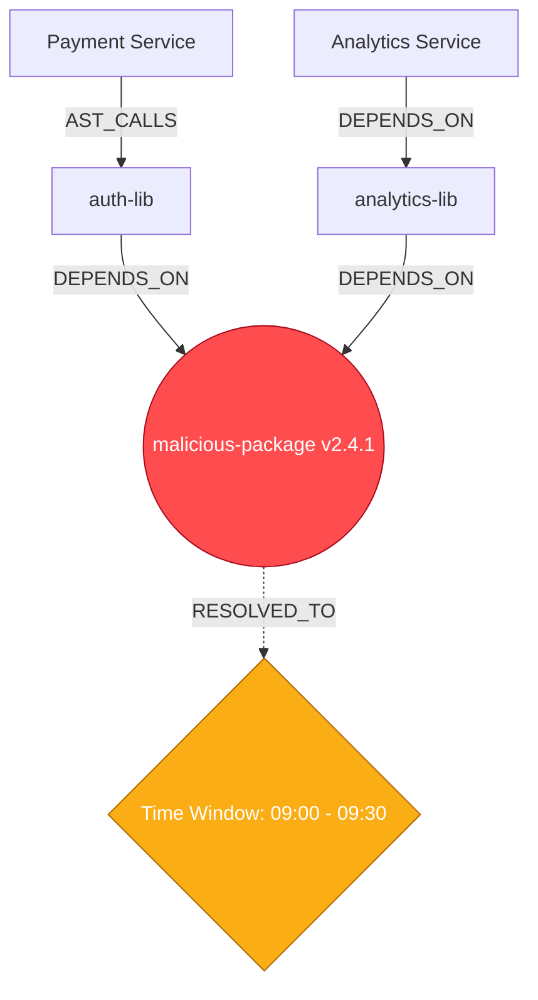

<div align="center">
  <h1>🛡️ HydraGuard</h1>
  <p><strong>Instant Supply Chain Blast Radius & Reachability Analysis</strong></p>
  <p><i>A submission for the <a href="https://hackhydra.hydradb.com/">HackHydra Hackathon (Aug 12-20, 2026)</a> — Track 02 (Option A)</i></p>

  <p>
    <a href="#-the-problem"></a>
    <a href="#-key-innovations"></a>
    <a href="#-how-it-works"></a>
  </p>
</div>

---

## 🚨 The Problem: The Speed of Supply Chain Attacks

When a massive supply chain compromise hits the npm or PyPI ecosystem, security teams face a terrifying question: **"Are we exposed?"** 

Traditional vulnerability scanners are painfully slow. They look at flat text, `package.json` files, and semantic similarity. But a supply chain attack is **fundamentally a graph traversal problem**. 

If `Package X` is hacked, you don't just need to know who installed it. You need to know:
1. Which internal services **transitively** depend on it?
2. Did they resolve the malicious version during the exact **time window** of the attack?
3. Are those services actually **reaching** the vulnerable code?

## 💡 The Solution: HydraGuard

**HydraGuard** is a next-generation security intelligence system built on **HydraDB**. 

Instead of searching for vulnerabilities, HydraGuard maps your entire software ecosystem (Repositories, Applications, Packages, Versions, and AST Code logic) into a massive, interconnected graph. When a zero-day drops, HydraGuard performs instant **transitive reverse dependency closures** to calculate your exact blast radius.

---

## 🚀 Key Innovations (Why HydraGuard is Different)

We didn't just build a dependency tracker. We built a proactive threat-modeling engine using out-of-the-box graph concepts.

### 🥇 1. The "Reachability" Graph (AST + Dependencies)
Saying *"Service A is vulnerable"* isn't enough. We combined the supply chain dependency graph with the Abstract Syntax Tree (AST) code graph. 
* **The Magic:** HydraGuard traverses from the compromised external package, into your codebase, and down to the exact function call.
* **The Result:** It doesn't just flag a repo; it tells you: *"Service A is highly vulnerable because `auth.ts` on line 42 calls `bad_function()` from the compromised package."*

### 🥈 2. The "Time-Travel" Graph (Temporal Blast Radius)
Lockfiles change constantly. A package might be clean today, but was compromised for a 4-hour window yesterday. 
* **The Magic:** We encode timestamps directly into the graph edges (e.g., `RESOLVED_TO` contains `start_time` and `end_time`).
* **The Result:** We query the graph historically: *"Which internal microservices deployed a build during the specific 4-hour window that the malicious package was live?"*

### 🥉 3. Proactive "Wargaming" (Attack Path Prediction)
Don't wait for a breach. HydraGuard acts as a proactive threat-modeling tool.
* **The Magic:** Using graph centrality algorithms, we identify the "crown jewels" of your supply chain—the obscure transitive dependencies that hold your infrastructure together.
* **The Result:** A **"Detonate"** button in the UI. Click a deeply buried package, and watch the graph visually explode outward, calculating that a theoretical compromise here would take down 98% of your critical services.

---

## 🧠 Under the Hood (HydraDB Data Model)

To achieve this, we leverage HydraDB's graph-native architecture. Vector databases search for similarity; HydraDB traces exact, multi-hop relationships instantly.



### Core Ontology
* **Nodes:** `Repository`, `Application`, `Service`, `Package`, `PackageVersion`, `Function`, `Maintainer`
* **Edges:** `DEPENDS_ON`, `AST_CALLS`, `HAS_VERSION`, `RESOLVED_TO`, `MAINTAINED_BY`

---

## 💻 Project Structure

```text
HydraGuard/
├── ingestion/          # Python engine for PyPI/npm data & AST parsing
│   ├── ast_parser/     # Extracts code reachability relationships
│   └── hydra_loader.py # Feeds nodes/edges into HydraDB
├── dashboard/          # Next.js/Vite Web UI for graph visualization
│   ├── src/components/ # Blast Radius and Wargaming UI components
│   └── src/api/        # Graph traversal endpoints
└── README.md
```

## 🛠️ Setup & Installation

*(Coming soon - instructions to spin up HydraDB, run the ingestion pipeline, and launch the dashboard)*

1. Start HydraDB instance
2. Run data ingestion: `python ingestion/main.py`
3. Start UI: `cd dashboard && npm run dev`

---

